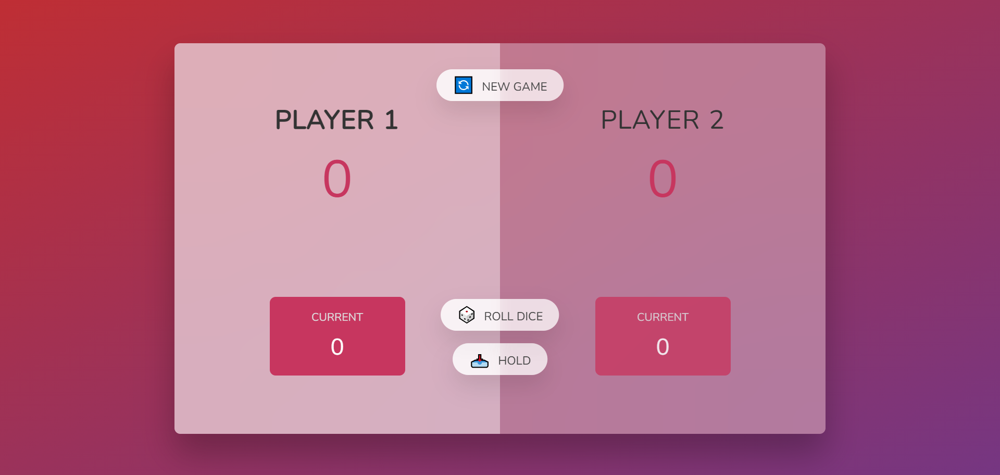

# Pig Game

A two-player dice game built with JavaScript.

## About the Project

Pig Game is a fun multiplayer dice game where two players compete to reach 100 points first.

This project was built as part of Jonas Schmedtmann JavaScript course to practice DOM manipulation and game logic.

## Game Rules

- Two players take turns rolling a dice
- Each roll adds to the current score
- If a player rolls a \*1, they lose their current score and turn switches
- Players can choose to Hold to save their current score
- First player to reach 100 points\* wins 🏆

## Technologies Used

- HTML
- CSS
- JavaScript (DOM manipulation, Events, State management)

## What I Learned

- Working with complex game logic
- Managing application state
- DOM manipulation and event handling
- Writing clean and structured JavaScript code

## Live Demo Try the game here: https://github.com/Navid-Mzn/Pig-Game.git

## 📸 Screenshot

